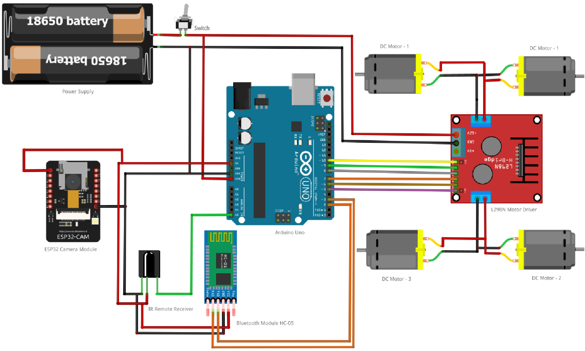
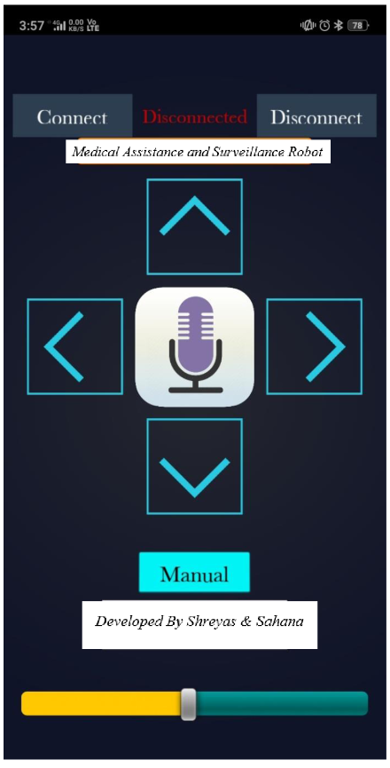

# Medical-Assistance-and-Surveillance-Robot
This project mainly aims to eradicate issues which might probably occur during treating patients in quarantine chambers.

|  | 
|:--:| 
| **Figure 1 :** *Circuit Design* |

|  | 
|:--:| 
| **Figure 2 :** *Mobile Application Overveiw* |
